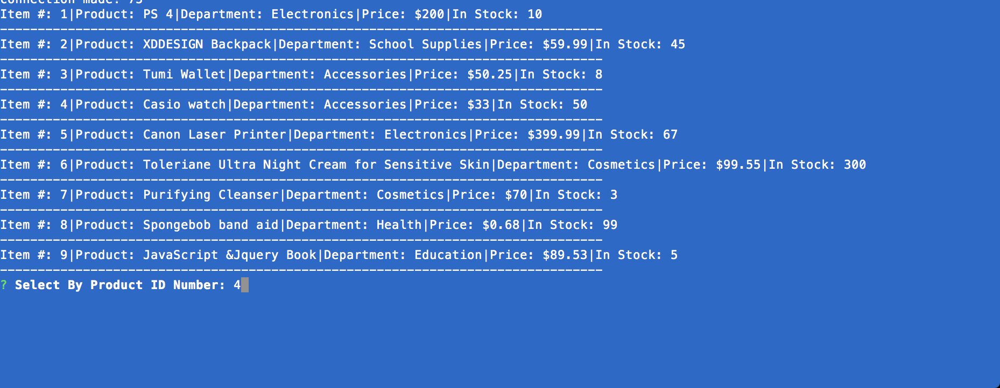
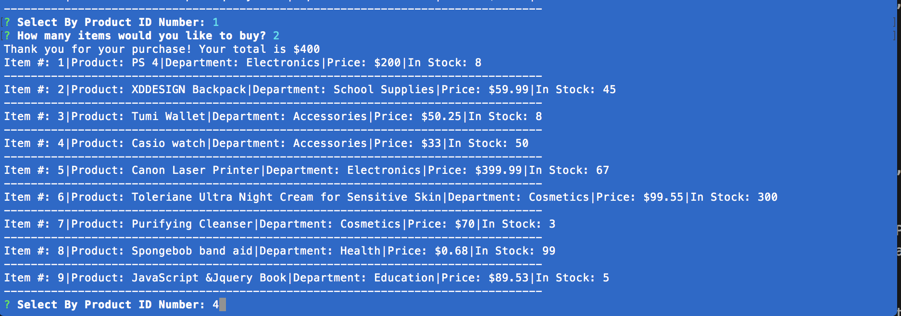
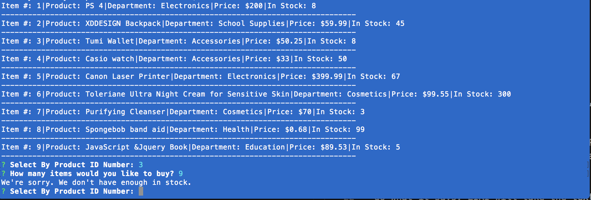

# BAMAZON

# ASSIGMENT

Bamazon in online shopping app using MySQL and node.js. This app prompts the user to choose the product by the ID number that they would like to purchase. The user can choose how much qty they want to buy, if there is enough qty, the message will be given to thank them for their bussines and the total cost. If not there will be message, stating: Sorry not enough quantity in stock. All the inventory willis stored im MySQL Table.

# INSTRUCTION OF THE BAMAZON APP

This shopping app will take orders from custoers and deplete from Bamazon store inventory.

Initializing node bamazonCustomer.js in the command line will as what would you like to purchase by the product id and how much would you want to buy:

If there are enough quantities it will adjust to continue

If there are not enough quantity, message will dispaly:(We're sorry. We don't have enough in stock)

This is how the app works.

Thank you.